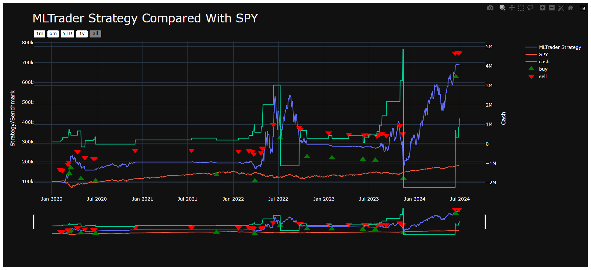

# CogniTrade

Cognitive Trading (CogniTrade) is an AI-powered trading bot designed to trade autonomously using both traditional trading strategies and machine learning models.

## Features
- Automated trading using Alpaca API
- Backtesting framework with Python & YahooDataBacktesting
- Transformer model integration for trend prediction through sentiment analysis of current news

## Flow of Project

- Create a baseline bot using a framework like `lumibot`.
- Implement dynamic position sizing based on cash risk and set limits such as take profit and stop loss orders.
- Retrieve news articles using the `alpaca-trade-api-python` and format them for sentiment analysis.
- Leverage the FinBERT model to estimate the sentiment of news articles and generate a probability score.
- Incorporate the sentiment signal into the trading algorithm to trigger buy or sell orders based on strong positive or negative sentiment.

## Installation

Follow these steps to set up your environment and run the bot:

1. **Clone the Repository:**

   ```bash
   git clone https://github.com/yourusername/ai-trading-bot.git
   ```

2. **Create a Virtual Environment**: Use `venv` to create a virtual environment for managing dependencies:

   ```bash
   python -m venv myenv
   myenv\Scripts\activate # for Windows
   ```

3. **Install Required Libraries**:

   ```bash
   pip install lumibot timedelta alpaca-trade-api==3.1.1
   pip install torch torchvision torchaudio transformers
   ```

4. **Configure Environment Variables**: Create a `.env` file with your API keys:

   ``` 
   API_KEY = YOUR_KEY
   API_SECRET = YOUR_KEY
   BASE_URL = "https://paper-api.alpaca.markets/v2"
   ```

5. **Run the Trading Bot:**

   ```bash
   python trading_bot.py
   ```

## Results




For detailed results, please refer to the [`results`](results) folder.

## Contributing

Contributions to the trading bot are welcome. Please fork the repository and submit a pull request with your features or fixes.

## Disclaimer

This bot is for educational purposes only. Use at your own risk. No financial advice. Always remember, live trading carries risk and it's important to test extensively in simulation environments before deploying any trading strategy with real capital.

## Referernces

[PyTorch Installation Instructions](https://pytorch.org/)

[Lumibot](https://lumibot.lumiwealth.com/)